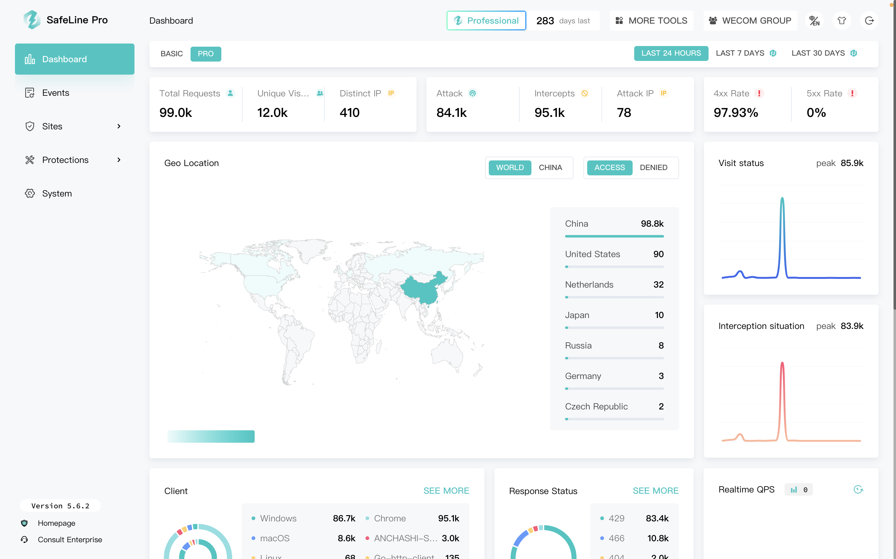

<p align="center">
  <a href="./README_EN.md">English</a> | 
  <a href="./">中文</a>
</p>
<h1 align="center">SafeLine - The Best WAF For Community</h1>

<p align="center">
  
</p>
<br>
<p align="center">
  
  
  
  
  
</p>

<p align="center">
  <a href="https://waf-ce.chaitin.cn/">Home Page</a> | 
  <a href="https://demo.waf-ce.chaitin.cn:9443/dashboard">Online Demo</a> | 
  <a href="https://waf-ce.chaitin.cn/posts/guide_introduction">Documents</a>
</p>

A simple, easy-to-use, and powerful free WAF. Based on the industry-leading semantic engine detection technology, it serves as a reverse proxy access to protect your website.

- Cumulative installations exceed **130,000** units
- Protecting websites over **1,000,000**
- Processing HTTP requests over **30,000,000,000** times per day
- Intercepting attacks over **50,000,000** times per day

The core detection capability is driven by intelligent semantic analysis algorithms, tailored for the community, keep hackers away from you.



<h4 align="center">Related Repo</h4>
<p align="center">
  <a href="https://github.com/chaitin/yanshi">Automaton Generator</a> | 
  <a href="https://github.com/chaitin/safeline-open-platform">Lua Plugin</a> | 
  <a href="https://github.com/chaitin/lua-resty-t1k">T1K Protocol</a> |
  <a href="https://github.com/chaitin/blazehttp">WAF Test Tool</a>
</p>

## Features

#### Convenience

Adopting containerized deployment, installation can be completed with one command at zero cost. Security configurations are ready to use out of the box, requiring no manual maintenance and enabling secure and effortless management.

#### Security

Pioneering industry-leading intelligent semantic analysis algorithms for precise detection, low false positives, and resistance to circumvention. Unconstrained by rules, the semantic analysis algorithm equips users to confidently confront unknown 0day attack features.

#### High Performance

Ruleless engine, linear security detection algorithm, with an average request detection latency at the millisecond level. Strong concurrency capability, effortlessly detecting 2000+ TPS on a single core; with sufficient hardware, there is no upper limit to the supported traffic scale.

#### High Availability

The traffic processing engine is developed based on Nginx, guaranteeing both performance and stability. It incorporates a comprehensive health check mechanism, ensuring a service availability of up to 99.99%.


## 🚀 Get Started

### Environment

- Operating System: Linux
- Instruction Architecture: x86_64
- Software Dependencies: Docker version 20.10.6 or higher
- Software Dependencies: Docker Compose version 2.0.0 or higher
- Minimum Environment: 1 core CPU / 1 GB memory / 10 GB disk

### Setup

```
bash -c "$(curl -fsSLk https://waf-ce.chaitin.cn/release/latest/setup.sh)"
```

> for information for <a href="https://waf-ce.chaitin.cn/posts/guide_install">安装雷池</a>

## 🕹️ use SafeLine

### Login

After opening the backend management page in the browser at `https://<IP-or-HOSTNAME>:9443`, follow the on-screen instructions to scan the QR code using an authentication app that supports TOTP, and then enter the dynamic password to log in.


### Settings

SafeLine is accessed in reverse proxy mode, receiving traffic before the web server, detecting and cleaning attack behavior in the traffic, and then forwarding the cleaned traffic to the web server.


<font color=grey>💡 TIPS: After adding, executing `curl -H "Host: <domain>" http://<IP-or-HOSTNAME>:<port>` should be able to get the response of the website.

### test

Use the following step to simulate hacker attack and see how effective the protection of the SafeLine is.

- access `http://<IP-or-HOSTNAME>:<PORT>/?id=1%20AND%201=1`
- access `http://<IP-or-HOSTNAME>:<PORT>/?a=<script>alert(1)</script>`


> more test for <a href="https://waf-ce.chaitin.cn/posts/guide_test">测试防护效果</a>

### FAQ

- [SETUP](https://waf-ce.chaitin.cn/posts/faq_install)
- [LOGIN](https://waf-ce.chaitin.cn/posts/faq_login)
- [PROXY](https://waf-ce.chaitin.cn/posts/faq_access)
- [SETTINGS](https://waf-ce.chaitin.cn/posts/faq_config)
- [OTHERS](https://waf-ce.chaitin.cn/posts/faq_other)

## 🏘️ Talk Group

1. Bug feedback and feature suggestions can be directly submitted through GitHub Issues.
2. Join <a target="_blank" href="https://discord.gg/wyshSVuvxC">SafeLine Discord</a> for more discussions.

## Star History <a name="star-history"></a>

<a href="https://github.com/chaitin/safeline/stargazers">
    
</a> 
