

  

<h4 align="center">
  SafeLine - Make your web apps secure
</h4>

  <a target="_blank" href="https://ly.safepoint.cloud/laA8asp">🏠 Website</a> &nbsp; | &nbsp;
  <a target="_blank" href="https://ly.safepoint.cloud/w2AeHhb">📖 Docs</a> &nbsp; | &nbsp;
  <a target="_blank" href="https://ly.safepoint.cloud/hSMd4SH">🔍 Live Demo</a> &nbsp; | &nbsp;
  <a target="_blank" href="https://discord.gg/SVnZGzHFvn">🙋‍♂️ Discord</a> &nbsp; | &nbsp;
  <a target="_blank" href="/README_CN.md">中文版</a>

## 👋 INTRODUCTION

SafeLine is a self-hosted **`WAF(Web Application Firewall)`** to protect your web apps from attacks and exploits.

A web application firewall helps protect web apps by filtering and monitoring HTTP traffic between a web application and the Internet. It typically protects web apps from attacks such as `SQL injection`, `XSS`, `code injection`, `os command injection`, `CRLF injection`, `ldap injection`, `xpath injection`, `RCE`, `XXE`, `SSRF`, `path traversal`, `backdoor`, `bruteforce`, `http-flood`, `bot abused`, among others.

#### 💡 How It Works

By deploying a WAF in front of a web application, a shield is placed between the web application and the Internet. While a proxy server protects a client machine’s identity by using an intermediary, a WAF is a type of reverse-proxy, protecting the server from exposure by having clients pass through the WAF before reaching the server.

A WAF protects your web apps by filtering, monitoring, and blocking any malicious HTTP/S traffic traveling to the web application, and prevents any unauthorized data from leaving the app. It does this by adhering to a set of policies that help determine what traffic is malicious and what traffic is safe. Just as a proxy server acts as an intermediary to protect the identity of a client, a WAF operates in similar fashion but acting as a reverse proxy intermediary that protects the web app server from a potentially malicious client.

its core capabilities include:

- Defenses for web attacks
- Proactive bot abused defense 
- HTML & JS code encryption
- IP-based rate limiting
- Web Access Control List

#### ⚡️ Screenshots

| 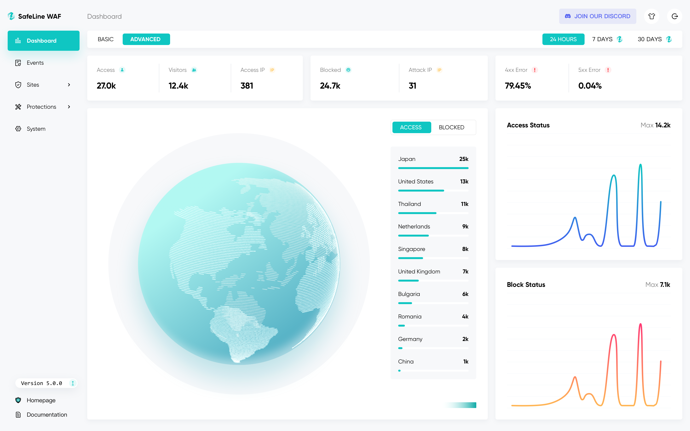 | 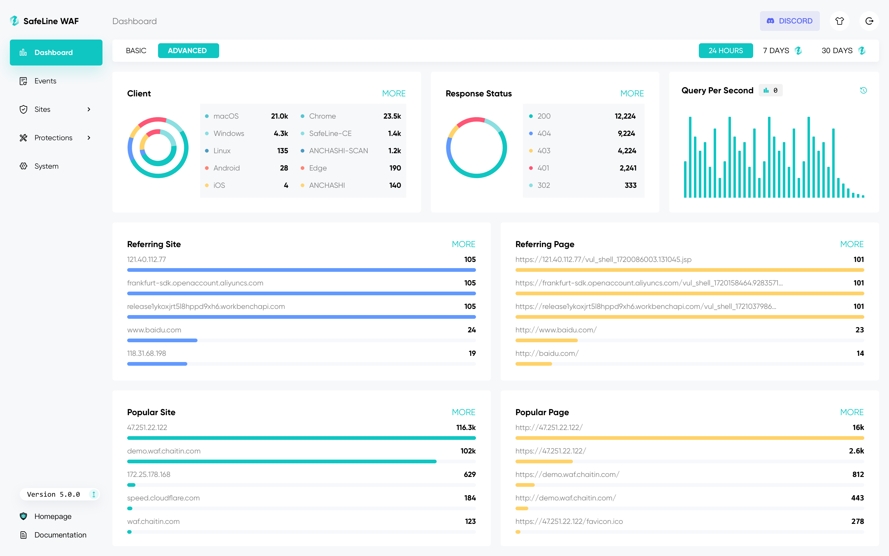 |
| ------------------------------------------------- | ------------------------------------------------- | 
| 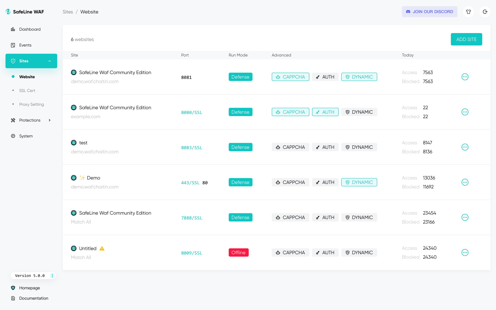 | 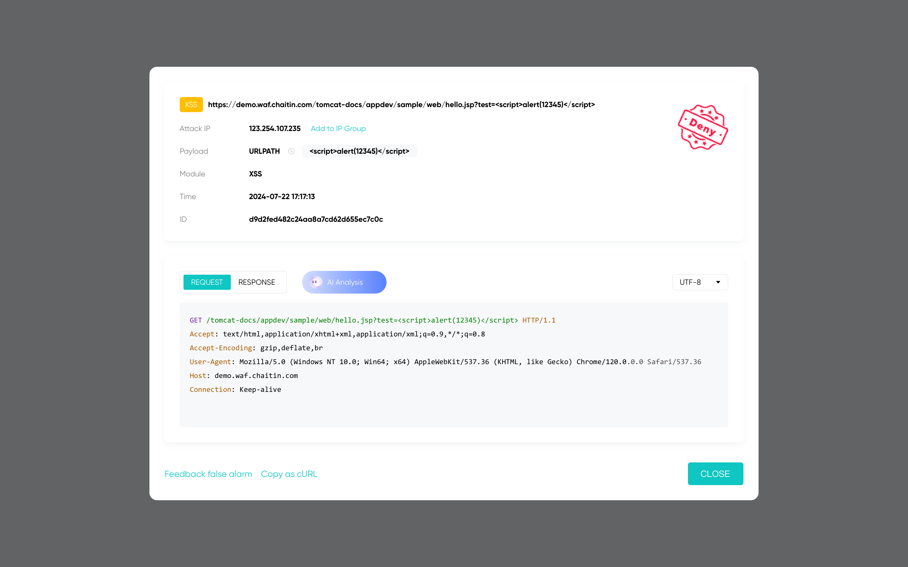 | 

Get [Live Demo](https://demo.waf.chaitin.com:9443/)

## 🔥 FEATURES

List of the main features as follows:

- **`Block Web Attacks`**
  - It defenses for all of web attacks, such as `SQL injection`, `XSS`, `code injection`, `os command injection`, `CRLF injection`, `XXE`, `SSRF`, `path traversal` and so on.
- **`Rate Limiting`**
  - Defend your web apps against `DoS attacks`, `bruteforce attempts`, `traffic surges`, and other types of abuse by throttling traffic that exceeds defined limits.
- **`Anti-Bot Challenge`**
  - Anti-Bot challenges to protect your website from `bot attacks`, humen users will be allowed, crawlers and bots will be blocked.
- **`Authentication Challenge`**
  - When authentication challenge turned on, visitors need to enter the password, otherwise they will be blocked.
- **`Dynamic Protection`**
  - When dynamic protection turned on, html and js codes in your web server will be dynamically encrypted by each time you visit.

#### 🧩 Showcases

|                               | Legitimate User                                     | Malicious User                                                   |
| ----------------------------- | --------------------------------------------------- | ---------------------------------------------------------------- | 
| **`Block Web Attacks`**       |        | 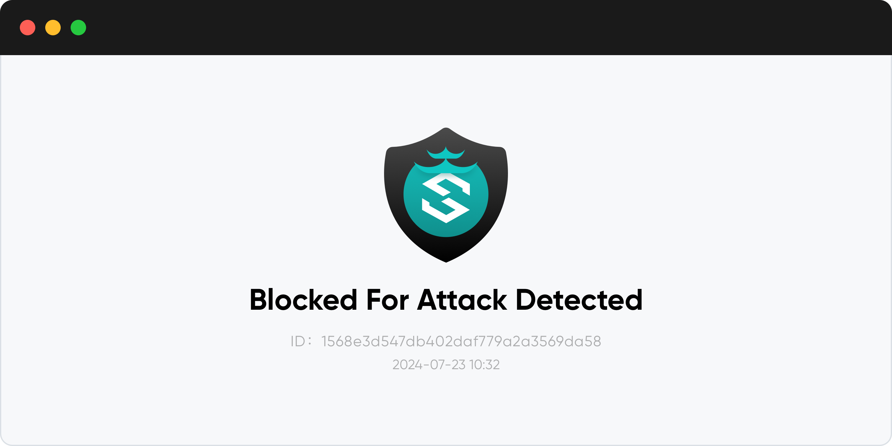 |
| **`Rate Limiting`**           |        | 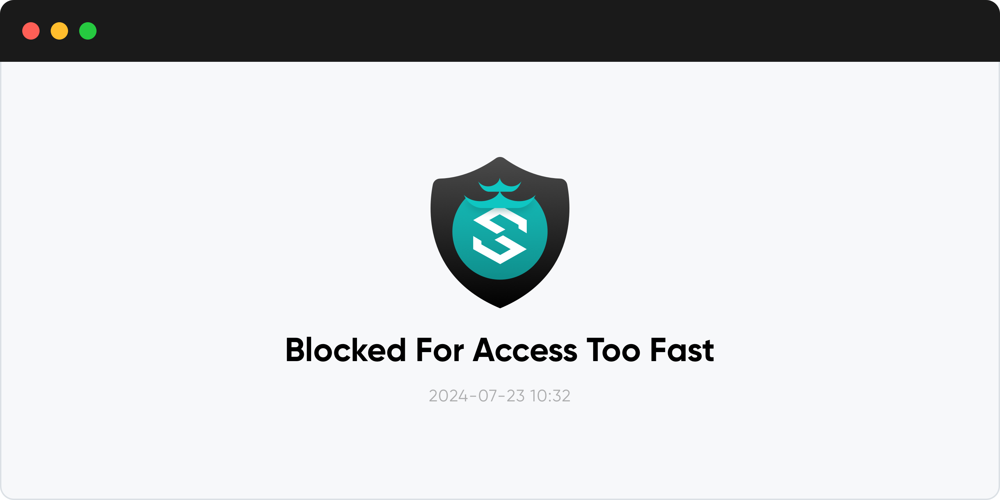 |
| **`Anti-Bot Challenge`**       | 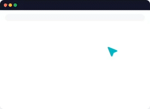      |                      |
| **`Auth Challenge`**          | 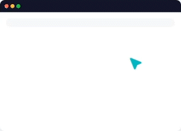         | 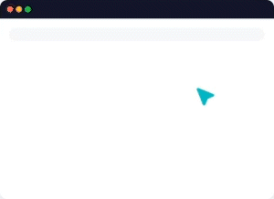                        |
| **`HTML Dynamic Protection`** | 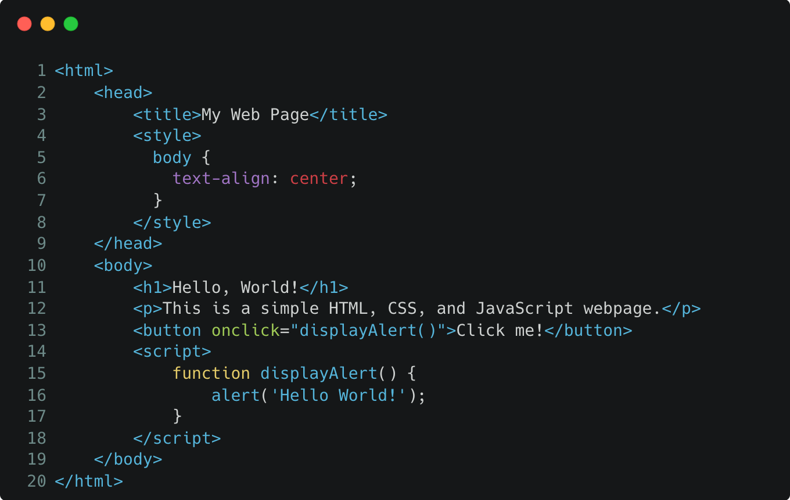 | 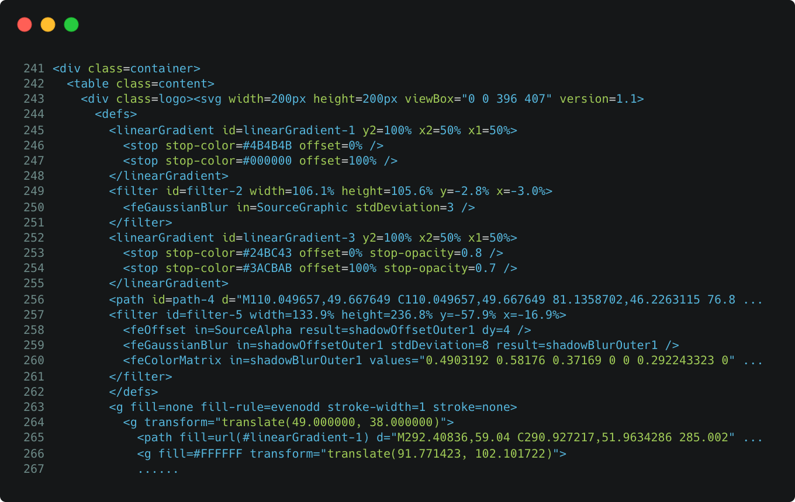              |
| **`JS Dynamic Protection`**   | 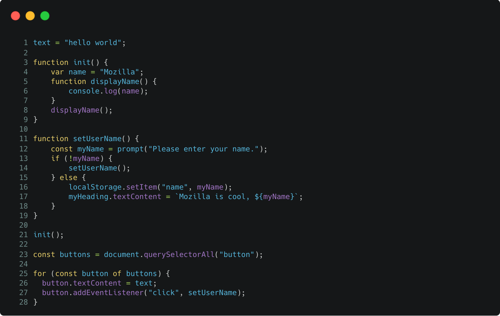   | 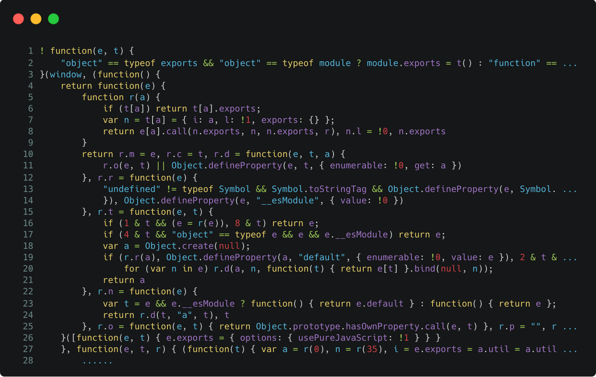                | 

## 🚀 Quickstart

> [!WARNING]
> 中国大陆用户安装国际版可能会导致无法连接云服务，请查看 [中文版安装文档](https://docs.waf-ce.chaitin.cn/zh/%E4%B8%8A%E6%89%8B%E6%8C%87%E5%8D%97/%E5%AE%89%E8%A3%85%E9%9B%B7%E6%B1%A0)

#### 📦 Installing

Information on how to install SafeLine can be found in the [Install Guide](https://docs.waf.chaitin.com/en/GetStarted/Deploy)

#### ⚙️ Protecting Web Apps

to see [Configuration](https://docs.waf.chaitin.com/en/GetStarted/AddApplication)

## 📋 More Informations

#### Effect Evaluation

| Metric            | ModSecurity, Level 1 | CloudFlare, Free     | SafeLine, Balance      | SafeLine, Strict      |
| ----------------- | -------------------- | -------------------- | ---------------------- | --------------------- |
| Total Samples     | 33669                | 33669                | 33669                  | 33669                 |
| **Detection**     | 69.74%               | 10.70%               | 71.65%                 | **76.17%**            |
| **False Positive**| 17.58%               | 0.07%                | **0.07%**              | 0.22%                 |
| **Accuracy**      | 82.20%               | 98.40%               | **99.45%**             | 99.38%                |

#### Is SafeLine Production-Ready?

Yes, SafeLine is production-ready.

- Over 180,000 installations worldwide
- Protecting over 1,000,000 Websites
- Handling over 30,000,000,000 HTTP Requests Daily

#### 🙋‍♂️ Community

Join our [Discord](https://discord.gg/SVnZGzHFvn) to get community support, the core team members are identified by the STAFF role in Discord.

- channel [#feedback](https://discord.com/channels/1243085666485534830/1243120292822253598): for new features discussion.
- channel [#FAQ](https://discord.com/channels/1243085666485534830/1263761679619981413): for FAQ.
- channel [#general](https://discord.com/channels/1243085666485534830/1243115843919806486): for any other questions.

Several contact options exist for our community, the primary one being Discord. These are in addition to GitHub issues for creating a new issue.

   &nbsp;
   &nbsp;
  

#### 💪 PRO Edition

Coming soon!

#### 📝 License

See [LICENSE](/LICENSE.md) for details.
